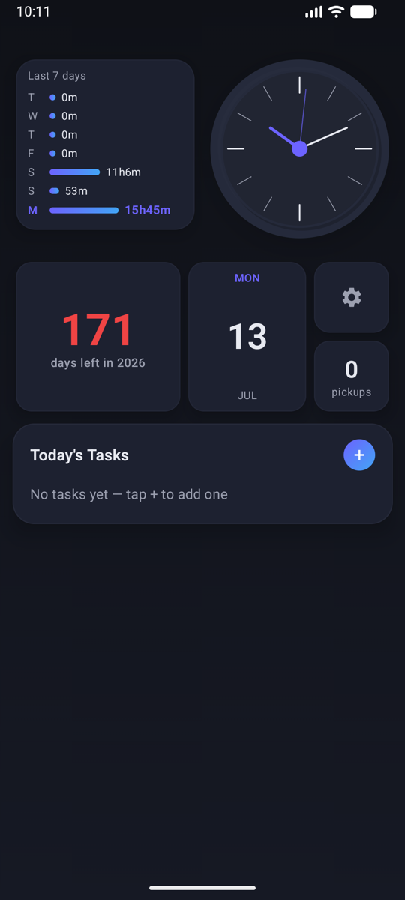
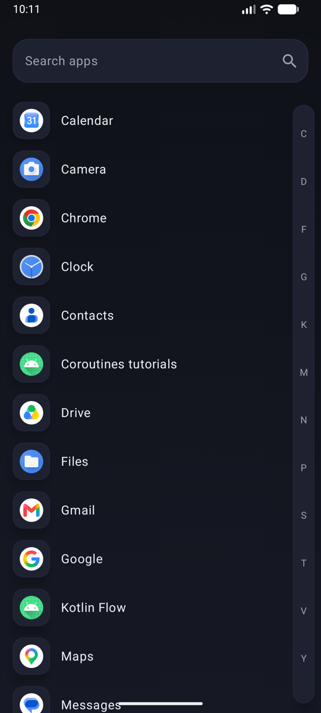
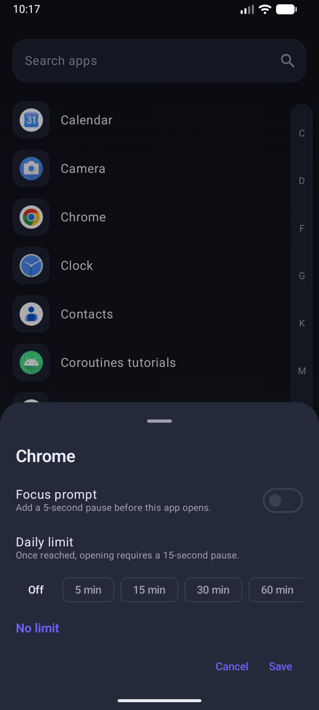
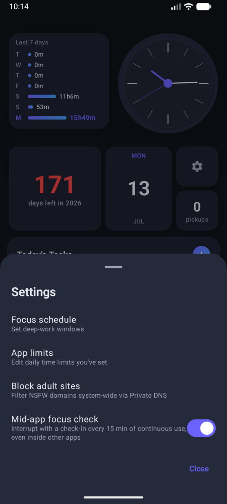
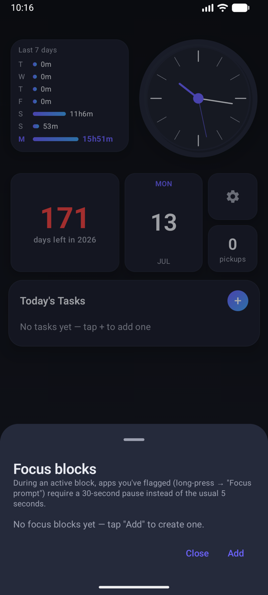
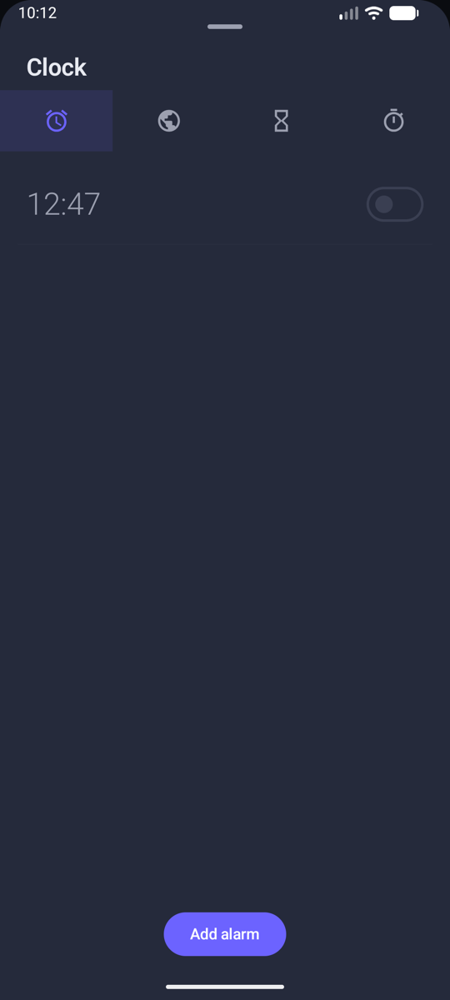

# Solo Leveling Launcher

A minimalist Android launcher that helps you level up your focus and beat phone overuse.

Instead of an endless grid of tempting icons, Solo Leveling Launcher puts your focus front and center — track your screen time, set daily limits on the apps that pull you in, and hard-block the ones you don't want to open at all. 100% on-device: no accounts, no ads, no tracking.

## Screenshots

| Home | App Drawer | Per-App Focus |
| :---: | :---: | :---: |
|  |  |  |

| Settings | Focus Blocks | Clock |
| :---: | :---: | :---: |
|  |  |  |

## Features

### 🏠 Distraction-free home screen
- Calm, neumorphic dark UI with an analog clock, date card, and a "days left in the year" reminder to keep you intentional
- Last-7-days screen-time chart and daily pickup counter, right on the home screen
- Today's tasks card with a matching home-screen widget (Glance)

### 🎯 Focus tools
- **Screen-time tracking** — daily usage, pickups, and per-app time via Android's UsageStats
- **Focus prompts** — long-press any app to add a 5-second pause before it opens
- **Daily app limits** — set a time limit per app; once reached, opening it requires a longer pause
- **Focus blocks** — schedule deep-work windows during which flagged apps require a 30-second pause
- **Mid-app focus check** — an optional gentle check-in after every 15 minutes of continuous use
- **App blocking** — hard-block distracting apps so they simply won't open
- **Adult-site blocking** — filter NSFW domains system-wide via Private DNS

### ⏰ Built-in clock suite
- Alarms with anti-snooze dismiss challenges (solve a math problem or shake the phone)
- World clock, timer, and stopwatch

### ✅ To-do list
- Lightweight daily task list stored locally with Room
- Add and toggle tasks straight from the home-screen widget

## Privacy

Everything runs 100% on-device. No accounts, no ads, no analytics — no data ever leaves your phone.

The app uses Android's Accessibility service **only** to notice when a blocked app comes to the foreground so it can show your focus reminder. It never reads screen content and never sends data anywhere. See the [privacy policy](store-assets/PRIVACY_POLICY.md) for details.

## Tech stack

- **Kotlin** 2.2 + **Jetpack Compose** (Material 3) — single-activity, fully Compose UI
- **Hilt** for dependency injection
- **Room** for local task storage
- **Glance** for the home-screen to-do widget
- **UsageStatsManager** for screen-time stats, **AccessibilityService** for app blocking
- Multi-module Gradle build (Kotlin DSL, version catalog)

## Project structure

```
├── app/                      # Application shell: MainActivity, onboarding,
│                             #   accessibility blocking service, to-do widget
├── solo_levelling_launcher/  # Launcher core: home screen, app drawer/search,
│                             #   usage stats, focus limits & blocking logic
├── clock/                    # Alarms (with dismiss challenges), world clock,
│                             #   timer, stopwatch
└── todo_list/                # Task list: Room database, repository, UI
```

## Getting started

**Requirements:** Android Studio (latest stable), JDK 17+, an Android device or emulator running API 24+.

1. Clone the repository:
   ```bash
   git clone https://github.com/emburaan/SoloLevelingLauncher.git
   ```
2. Open the project in Android Studio and let Gradle sync.
3. Run the `app` configuration on a device or emulator.
4. Press the home button and choose **Solo Leveling Launcher** as your default launcher (optional but recommended).

On first launch the app walks you through granting **Usage access** (for screen-time stats) and, if you enable app blocking, the **Accessibility service** — each with a clear in-app disclosure first.

### Release builds

Copy `keystore.properties.example` to `keystore.properties` and fill in your keystore details, then:

```bash
./gradlew :app:bundleRelease
```

## License

See [LICENSE.md](LICENSE.md) for details.
